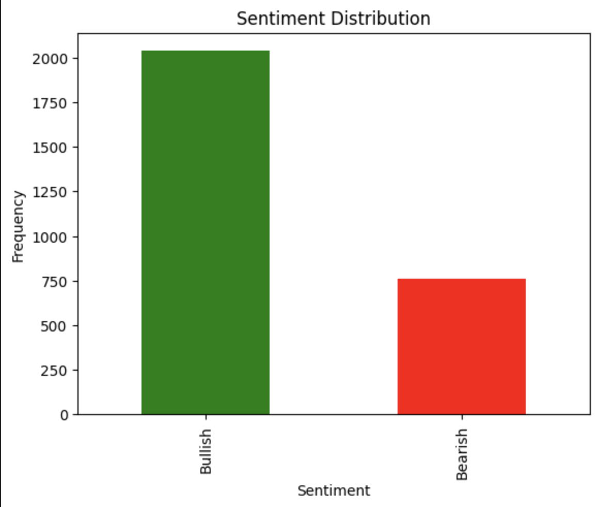
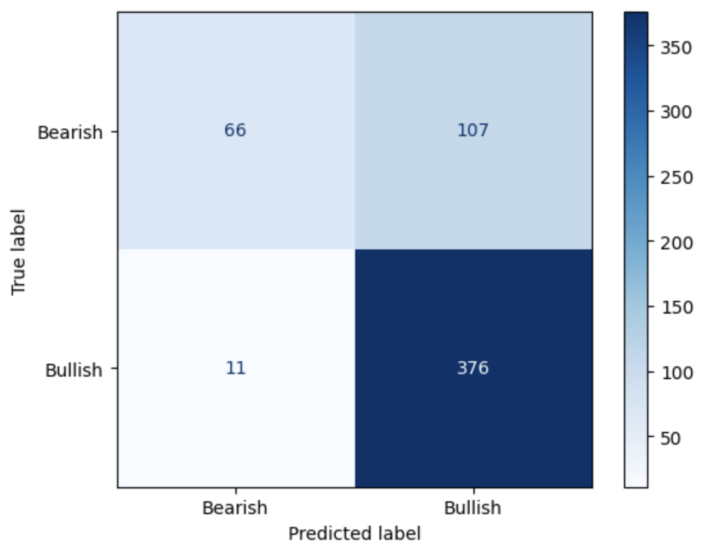

# Financial News Sentiment Analysis

This project uses **Natural Language Processing (NLP)** to classify financial news headlines as **bullish** or **bearish** for stock movement predictions.

## What I Used:
- **NLP with VADER**: Sentiment analysis of financial headlines.
- **Python libraries**: pandas, nltk, matplotlib, scikit-learn.
  
## How It Works:
- I applied **VADER** (Valence Aware Dictionary and sEntiment Reasoner) to classify financial news headlines.
- The sentiment was classified into **Bullish** or **Bearish**, based on the sentiment score.

### Link to Kaggle Project:
You can view the notebook and run it directly on Kaggle:  
https://www.kaggle.com/yourusername/financial-news-sentiment-analysis

## Getting Started

**Clone this repository**:
```bash
git clone https://github.com/yourusername/financial-news-sentiment-analysis.git
```

**Install required dependencies**:
```bash
pip3 install pandas nltk scikit-learn matplotlib
```

**Set up the VADER Lexicon**:

Download the VADER lexicon and add it to your project folder or specify the path in the script.

Run the Jupyter Notebook or Python script to see sentiment analysis in action.

**Demo**

## 📊 Sentiment Analysis Results  

**Inputting a Financial Headline for Sentiment Analysis**  
<p align="left">
  
</p>  

**Displaying the Sentiment Results of the Analysis**  
<p align="left">
  
</p>  

**Visualization of the Sentiment Distribution**  
<p align="left">
  
</p>  
